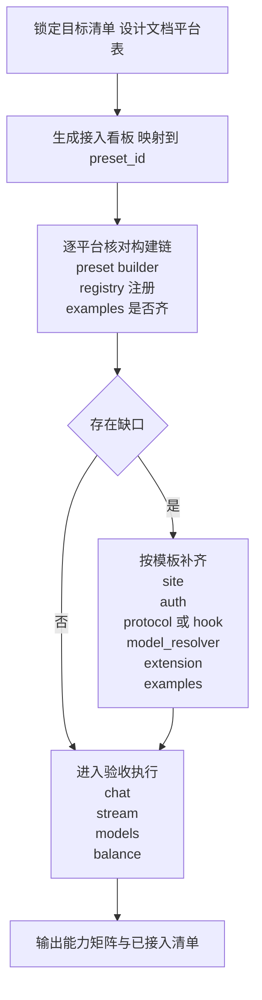

# nl_llm 全平台接入计划（以设计文档表为准，主线 nl_llm_v2）

## 0. 目标与范围
- 目标：把 `docs/nl_llm代码结构设计规范.md` 的 **8.2 已支持的平台**表（见 [`docs/nl_llm代码结构设计规范.md:926`](docs/nl_llm代码结构设计规范.md:926)）列出的平台，在 `nl_llm_v2` 上做到可构建、可运行、可验证。
- 主线 crate：`nl_llm_v2`（入口为 [`crates/nl_llm_v2/src/client.rs:45`](crates/nl_llm_v2/src/client.rs:45) 的 `LlmClient::from_preset`，preset 注册表在 [`crates/nl_llm_v2/src/presets/registry.rs:12`](crates/nl_llm_v2/src/presets/registry.rs:12)）。

## 1. 文档平台 -> nl_llm_v2 preset_id 映射（目标清单）
文档平台表条目（[`docs/nl_llm代码结构设计规范.md:930`](docs/nl_llm代码结构设计规范.md:930) 起）可直接映射到 `nl_llm_v2` 的 preset_id（注册表见 [`crates/nl_llm_v2/src/presets/registry.rs:21`](crates/nl_llm_v2/src/presets/registry.rs:21)）：

| 文档平台 | preset_id | 备注 |
|---|---:|---|
| OpenAI | openai | OpenAI 兼容协议 |
| Anthropic | claude | 文档用 Anthropic，代码用 claude 命名 |
| Gemini | gemini | 官方 API Key |
| Vertex AI | vertex | Service Account / Bearer Token |
| Vertex API | vertex_api | API Key 模式 |
| DeepSeek | deepseek | OpenAI 兼容 + 余额 |
| Moonshot | moonshot | OpenAI 兼容 |
| Qwen | qwen | OpenAI 兼容 |
| Kimi | kimi | OpenAI 兼容 + 余额 |
| 智谱 BigModel 国内 | zhipu | OpenAI 兼容 + 余额 |
| Z.AI 海外 | zai | 动态模型列表 + 余额 |
| Amp CLI | amp | provider 路由（见 [`crates/nl_llm_v2/src/client.rs:538`](crates/nl_llm_v2/src/client.rs:538)） |
| Codex OAuth | codex_oauth | OAuth 登录缓存 |
| Codex API | codex_api | API Key |
| iFlow | iflow | Cookie + thinking hook |
| OpenRouter | openrouter | provider 字段透传 |
| Gemini CLI | gemini_cli | CloudCode 协议 + OAuth |
| Antigravity | antigravity | CloudCode + OAuth |
| DMXAPI | dmxapi | 聚合平台 |
| Cubence | cubence | 聚合/工具平台代理 |
| RightCode | rightcode | 企业中转 |
| Azure OpenAI | azure_openai | endpoint + deployment |

结论：**目标清单在 v2 注册表里均已出现**（对照 [`crates/nl_llm_v2/src/presets/registry.rs:22`](crates/nl_llm_v2/src/presets/registry.rs:22) 到 [`crates/nl_llm_v2/src/presets/registry.rs:82`](crates/nl_llm_v2/src/presets/registry.rs:82)）。接下来的工作重点从“有没有”转为“是否可验收、是否例子齐全、是否行为与文档一致”。

## 2. 验收标准（Definition of Done）
对每个平台（每个 preset_id），给出一致的验收口径：

### 2.1 必选能力
- `complete`：`LlmClient::complete` 可返回 `LlmResponse`（入口见 [`crates/nl_llm_v2/src/client.rs:94`](crates/nl_llm_v2/src/client.rs:94)）。
- `stream`：`LlmClient::stream` 可返回流（入口见 [`crates/nl_llm_v2/src/client.rs:162`](crates/nl_llm_v2/src/client.rs:162)）。
- `models`：如果平台/实现支持 `ProviderExtension::list_models`，则 `client.list_models()` 可用（入口见 [`crates/nl_llm_v2/src/client.rs:230`](crates/nl_llm_v2/src/client.rs:230)）。

### 2.2 条件能力
- `auth`：需要 OAuth/SA/Cookie 的平台，必须提供可复用的缓存路径策略，并给出 Windows `.bat` 示例。
- `balance`：文档标注或实现支持余额查询的平台，`client.get_balance()` 可用（入口见 [`crates/nl_llm_v2/src/client.rs:242`](crates/nl_llm_v2/src/client.rs:242)）。

### 2.3 examples 约定
每个平台至少具备：
- `examples/<preset_id>/auth`（如需要）
- `examples/<preset_id>/chat`
- `examples/<preset_id>/stream`
- `examples/<preset_id>/models`
- `examples/<preset_id>/balance`（如支持）

> 现状：`crates/nl_llm_v2/examples/` 下已有大量平台示例目录，可作为验收基础。

## 3. “渠道接入看板”生成方式（要在实现前先做清单化）
需要生成一张可执行的表（建议落在一个 Markdown 看板里），每行一个目标平台，列包含：
- preset_id
- 协议：OpenAI / Claude / Gemini / CloudCode
- 认证：ApiKey / x-api-key / OAuth / SA / Cookie
- Site：具体 Site 实现文件
- Protocol：具体 Protocol 实现文件
- Hook：是否存在平台 Hook
- ModelResolver：静态/动态/混合
- Extension：是否实现 `list_models` / `get_balance`
- Examples：是否齐全（auth/chat/stream/models/balance）

该表将作为 Code 阶段逐项补齐的工作看板。

## 4. 实施步骤（从看板到落地）

## 5. 进入 Code 模式后的第一批动作（建议）
1) 先产出看板文件（单一来源），并自动/半自动从代码提取：
- 注册表 keys：[`crates/nl_llm_v2/src/presets/registry.rs:21`](crates/nl_llm_v2/src/presets/registry.rs:21)
- examples 目录：`crates/nl_llm_v2/examples/*`

2) 针对文档平台表逐项跑 smoke：
- `cargo run --example <platform>-chat` 这类命令若已存在则复用；不存在就补齐 example。

3) 将发现的缺口按优先级收敛：
- 先补“文档必列平台”的缺口
- 再修“v2 自带但未注册/未示例”的一致性问题（例如 `xai` 有 preset 模块，但注册表未出现，见 [`crates/nl_llm_v2/src/presets/xai.rs:1`](crates/nl_llm_v2/src/presets/xai.rs:1) vs [`crates/nl_llm_v2/src/presets/registry.rs:21`](crates/nl_llm_v2/src/presets/registry.rs:21)）。
