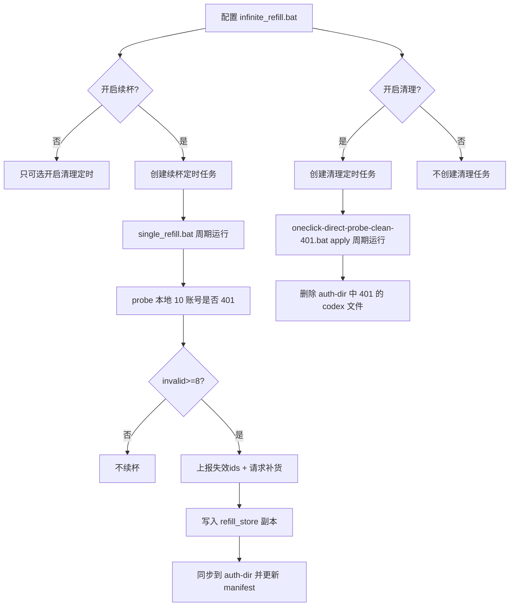

# 无限续杯 v2（解耦版）方案：自动清理 vs 续杯

> 目标：按你的更正，把“自动清理”和“无限续杯”作为**两套独立能力**，由一个“配置脚本”统一开关与调度，但运行逻辑不互相耦合。

## 1. 概念拆分（两套能力）

### 1.1 自动清理（可选开启）

- 职责：只负责清理 `auth-dir` 中无效 Codex 认证文件
- 判定：仅 `wham/usage` 返回 **HTTP 401** 才删除
- 入口：[`infinite_refill/oneclick_clean/oneclick-direct-probe-clean-401.bat`](../oneclick_clean/oneclick-direct-probe-clean-401.bat:1)
- 特征：不需要 key，不请求远端

### 1.2 无限续杯（需要 key 才能开启）

- 职责：维护“一个 key 对应一组账号”的可用性；当失效达到阈值才请求远端补货
- 判定：对“本地保存的一组账号认证文件”逐个探测；不可用=HTTP 401
- 阈值：10 个里 **>=8 个 401** 才触发续杯请求
- 特征：
  - 需要 key
  - 会保存“本地副本”以便审计与防重复下载
  - 会将可用账号“同步/覆盖”到 `auth-dir`（并按 manifest 精确删除上一次同步的那批文件）

## 2. 本地存储设计（新增）

新增目录：

- `oneclick_clean/state/`
  - `refill_config.json`：是否开启续杯、key、续杯频率、是否开启自动清理、清理频率、阈值等
  - `refill_state.json`：当前批次、账号列表、健康状态、上报状态、上次同步的 manifest
- `oneclick_clean/refill_store/`
  - 按 key/batch 保存**原始认证文件副本**（远端下发的 auth json 原样落盘）

建议命名：

- `oneclick_clean/refill_store/<key_hash>/<batch_id>/<account_id>.json`

> key 不建议明文进路径；可以用短 hash（例如 sha256 截断）做目录名。

## 3. 同步到 auth-dir 的策略（不误删）

核心原则：**只删自己同步进去的文件，不影响用户手工放入的其它 auth 文件**。

### 3.1 manifest

每次同步到 `auth-dir` 时写入 manifest：

- `oneclick_clean/state/refill_state.json::sync_manifest`
  - `synced_files`: [绝对路径]（上次同步的文件列表）
  - `synced_batch_id`

### 3.2 同步流程（覆盖式）

1) 从 manifest 读取上次 `synced_files`，逐个删除（忽略不存在）
2) 从 `refill_store` 选择要同步的一组文件（默认同步 10 个；或按你确认的策略同步）
3) 将这些文件复制到 `auth-dir`
4) 记录新的 `synced_files`

> 这样实现“删除上一批在 auth-dir 的 10 个并写入新批次”，且不会误删其他账号文件。

## 4. 续杯请求数量（你新增的要求）

你提到：续杯时“根据失效数量请求不定数量的认证”。这里建议落地为**补齐到 10**：

- 计算：`need = invalid_count`（例如 8 个失效就请求 8 个新号）
- 远端返回 `need` 个新认证文件
- 同步时：只替换失效的那 `need` 个（保留仍然可用的 2 个）

如果你仍坚持“每次触发就整批 10 全换”，则请求数固定 10。

## 5. BAT 结构与调度（一个配置脚本管理两套定时）

### 5.1 配置脚本（无限续杯 BAT）

- 文件：`oneclick_clean/infinite_refill.bat`
- 职责：
  - 交互写入 `refill_config.json`
  - 创建/更新 1~2 个计划任务：
    - 续杯任务（需要 key 才创建）
    - 清理任务（用户勾选才创建）

### 5.2 单次续杯 BAT

- 文件：`oneclick_clean/single_refill.bat`
- 职责：只做一次：探测 10 账号可用性 → 达阈值才续杯 → 同步到 auth-dir
- **不调用清理删除逻辑**

### 5.3 单次清理 BAT（保持独立）

- 文件：[`infinite_refill/oneclick_clean/oneclick-direct-probe-clean-401.bat`](../oneclick_clean/oneclick-direct-probe-clean-401.bat:1)

## 6. 工作流（Mermaid）

## 7. 实施要点（实现阶段会做的改造）

- 把 [`python.cmd_run_once()`](../oneclick_clean/refill_manager.py:969) 改成“仅 probe + 续杯 + 同步”，不再调用清理脚本。
- 新增 `refill_probe.py`（或在 refill_manager 中实现 probe）：对 `refill_store` 中的那 10 个账号进行 `wham/usage` 探测并统计 401。
- `infinite_refill.bat` 交互新增开关：是否创建“清理任务”。
