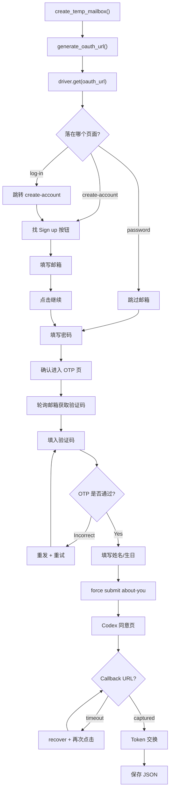

# 注册流程详解

## 整体架构

```
main() → 守护进程循环 → worker() → _run_register_once() → register()
                                       ↓
                               new_driver() → 初始化浏览器
                                       ↓
                               register() → 执行注册流程
                                       ↓
                               submit_callback_url() → Token 交换
```

## 注册流程（`register()` 函数）

### 阶段 1：邮箱创建 `get_email()`

```
create_temp_mailbox()
  └→ _pick_mailcreate_with_health()          // 健康域名优选
       └→ create_mailbox(provider="mailcreate")
            └→ _create_mailbox_mailcreate()
                 └→ MailCreateClient.new_address()  // HTTP POST /api/new_address
```

**邮箱提供商**（共 3 种）：

| 提供商 | 类型 | provider 值 | 配置变量 |
|--------|------|-------------|----------|
| **MailCreate** | 自建 Cloudflare Worker | `mailcreate` / `self` / `local` | `MAILCREATE_BASE_URL` + `MAILCREATE_CUSTOM_AUTH` |
| **GPTMail** | 公共临时邮箱 | `gptmail` / `gpt` | `GPTMAIL_API_KEY` 或 `GPTMAIL_KEYS_FILE` |
| **Mail.tm** | 公共 Hydra API | `mailtm` / `mail.tm` | `MAILTM_API_BASE`（默认 `https://api.mail.tm`）|

**调度器优先级**（`MAILBOX_PROVIDER=auto`，默认）：

| 基础优先级 | Slot | 说明 |
|-----------|------|------|
| 100 | `gptmail_test` | `gpt-test` 免费 key，每日 0:00 重置配额 |
| 80 | `mailcreate` | 自建服务，稳定可控 |
| 60 | `gptmail_paid` | keys_file 中的付费 key |
| 40 | `mailtm` | Mail.tm 公共免费，兜底 |

**动态调权**：`有效优先级 = 基础优先级 - (衰减后的失败次数 × 15)`
- 失败计数每 5 分钟半衰
- `gpt-test` 连续失败 ≥ 3 次 → 当日封禁，次日 0:00 自动解封
- 指定模式（非 auto）：失败不 fallback

### 阶段 2：OAuth URL 生成 `generate_oauth_url()`

生成 Codex CLI 的 OAuth 授权 URL：
```
https://auth.openai.com/oauth/authorize?
  client_id=app_EMoamEEZ73f0CkXaXp7hrann
  response_type=code
  redirect_uri=http://localhost:1455/auth/callback
  scope=openid+email+profile+offline_access
  code_challenge=xxx           // PKCE S256
  codex_cli_simplified_flow=true
```

### 阶段 3：浏览器导航至注册页

```
driver.get(oauth_url)
  → 等待 URL 包含 auth.openai.com
  → 若落在 log-in 页 → 跳转到 create-account
  → 点击 "Sign up" / "注册" 按钮
```

**UI 变体处理**：
- 有些 UI 直接落在 `create-account`，无 Sign up 按钮
- 有些直接进入密码阶段 → 跳过邮箱填写

### 阶段 4：填写邮箱

**元素定位策略（3 层 fallback）**：
1. **JS sweep**：遍历 `input[type="email"]`、`input[name*="email"]` 等选择器
2. **ID 定位**：`#_r_f_-email`（OpenAI 动态 ID 格式）
3. **CSS fallback**：`input[type="email"], input[name*="email"], input[id*="email"]`

**填值策略（2 层 fallback）**：
1. **JS 注入**：`el.value = v; el.dispatchEvent(new Event('input', {bubbles:true}))`
2. **模拟输入**：`_human_type()` 逐字符输入 + 随机延迟

**提交方式**：
1. 优先点击 `button[type="submit"][name="intent"][value="email"]`
2. 备选：JS 点击包含"继续/continue"文本的按钮
3. 兜底：`Keys.ENTER`

### 阶段 5：设置密码

与邮箱阶段类似的 3 层定位 + 2 层填值策略。额外增加了：
- **Cloudflare 人机验证检测**：`_is_human_verify_page()` 检测 "verify you are human" 等文本
- **Challenge 宽限轮次**：最多等待 6 轮（Cloudflare 自动通过）
- **Active element fallback**：密码框已获焦时直接使用

### 阶段 6：OTP 验证码

```
确认进入验证码页面（input[autocomplete="one-time-code"]）
  → 调用 get_oai_code() → wait_openai_code()
      → MailCreateClient.list_mails() 轮询
      → 正则提取 6 位数字验证码
  → 填入验证码
      → 优先：单输入框 send_keys(code)
      → 备选：分段输入（6 个独立 input 框）
  → 提交后等待页面跳转
      → 支持 "Incorrect code" 检测和自动重发
```

### 阶段 7：姓名和生日

**姓名填写**：
- 检测 first/last name 分离输入或 full name 统一输入
- 使用 `generate_name()` 随机生成

**生日填写**（4 层策略）：
1. **Select 下拉框**：年/月/日 3 个 `<select>` 元素
2. **Input 分段框**：mm/dd/yyyy 3 个 `<input>` 元素
3. **单一日期框**：`<input type="date">` 或 masked input
4. **React-Aria 段式输入**：`contenteditable div[data-type="month/day/year"]`
   - OpenAI `/about-you` 页使用此方案
   - 需同时更新隐藏的 `input[name="birthday"]`

**强制提交**：
- `_force_submit_about_you_form()` 直接注入隐藏 DOM 元素后 submit 表单
- 绕过 React 状态管控，防止生日被覆盖为 TODAY

### 阶段 8：Codex 同意页

OpenAI 会显示 "使用 ChatGPT 登录到 Codex" 的授权确认页。

**处理策略**：
1. `_click_final_continue_if_present()`：XPath 匹配 "Agree/Continue/继续/同意"
2. `smart_wait` + fallback 点击
3. `_maybe_click_consent_continue_once()`：更激进的 JS 匹配
4. `_maybe_recover_from_terms_page()`：误入 policies 页时回退

**循环重试**：最多 6 次尝试（recover + consent click + 等待 callback 12s）。

### 阶段 9：Callback URL 捕获与 Token 交换

```
WebDriverWait → URL 包含 localhost:1455
  → 解析 callback_url 中的 code 参数
  → submit_callback_url()
      → PKCE code_verifier + authorization_code
      → POST https://auth.openai.com/oauth/token
      → 获取 access_token + refresh_token
  → 保存为 JSON 文件
```

## 流程图


